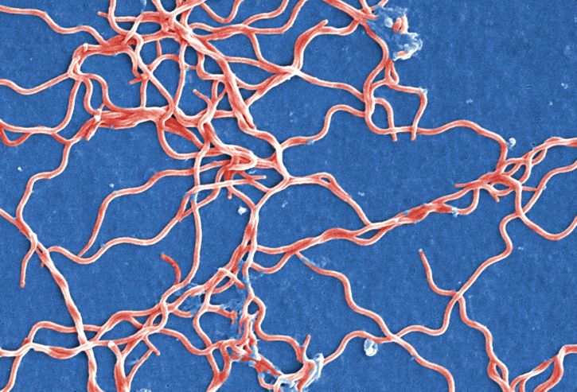

Initial Setup
```{r}
library(stringr)
library(knitr)
```


Import Sequences file and create shorthand name for use in tables
```{r}
data = read.csv("Sequences.csv")
ChartNames = ncbi_ids
```

This section of code will count the number of each base pair in each of the three sequences
```{r}
countA = 0; countT = 0; countG = 0; countC = 0
for (i in 1:length(data$X)) {
  countA = 0; countT = 0; countG = 0; countC = 0
  countA = str_count(data$Sequence[i], "A")
  print(paste("There are ", countA, " A nucelotides in sequence", ChartNames[i]))
  countT = str_count(data$Sequence[i], "T")
  print(paste("There are ", countT, " T nucelotides in sequence", ChartNames[i]))
  countG = str_count(data$Sequence[i], "G")
  print(paste("There are ", countG, " G nucelotides in sequence", ChartNames[i]))
  countC = str_count(data$Sequence[i], "C")
  print(paste("There are ", countC, " A nucelotides in sequence", ChartNames[i]))
}
  
```

This section of code will print out each sequence
```{r}
print(paste(data$Sequence))
```

This section will print the number of nucleotides as a table
```{r}
NumberofA = c(str_count(data$Sequence[1], "A"), str_count(data$Sequence[2], "A"), str_count(data$Sequence[3], "A"))

NumberofT = c(str_count(data$Sequence[1], "T"), str_count(data$Sequence[2], "T"), str_count(data$Sequence[3], "T"))

NumberofG = c(str_count(data$Sequence[1], "G"), str_count(data$Sequence[2], "G"), str_count(data$Sequence[3], "G"))

NumberofC = c(str_count(data$Sequence[1], "C"), str_count(data$Sequence[2], "C"), str_count(data$Sequence[3], "C"))

NucTable = data.frame(Name = ChartNames, A = NumberofA, T = NumberofT, G = NumberofG, C = NumberofC)
print(NucTable)
```

This section will calculate the GC content of each sequence in a percentage
```{r}
GCTable = data.frame(Sequence.ID = ChartNames, GC.Content = c(0, 0, 0)) 
countA = 0; countT = 0; countG = 0; countC = 0
for (i in 1:length(data$X)) {
  countA = 0; countT = 0; countG = 0; countC = 0; temp1 = 0
  countA = str_count(data$Sequence[i], "A")
  countT = str_count(data$Sequence[i], "T")
  countG = str_count(data$Sequence[i], "G")
  countC = str_count(data$Sequence[i], "C")
  temp1 = sum(countC, countG)/sum(countA, countC, countG, countT)
  GCTable$GC.Content[i] = print(paste(temp1, "%"))
}
print(GCTable)
```

The bacteria that is being used in this assignment is called Borrelia burgdorferi
```{r}

```
More information can be found at https://en.wikipedia.org/wiki/Borrelia_burgdorferi

